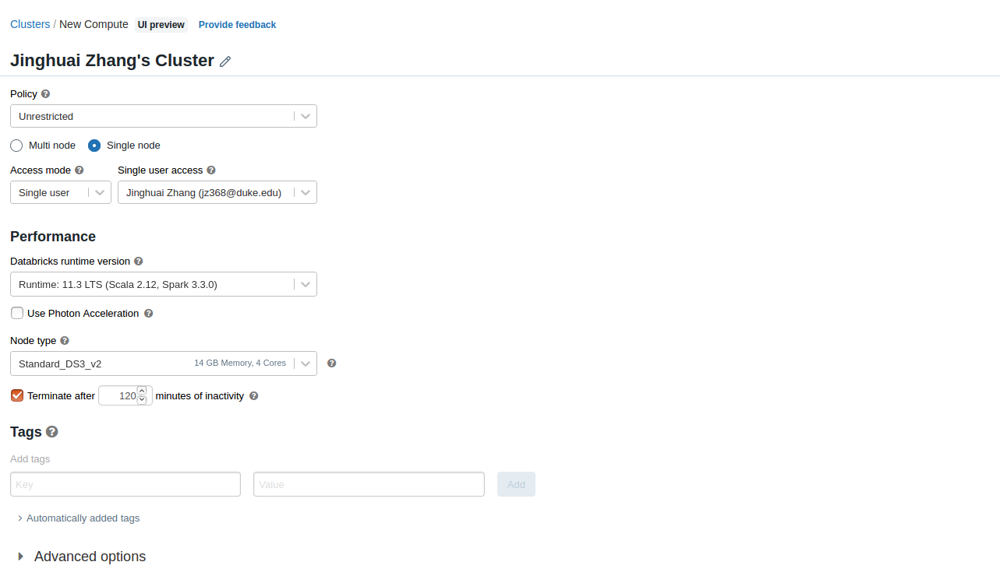
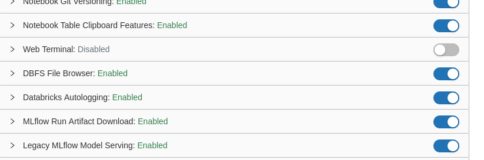
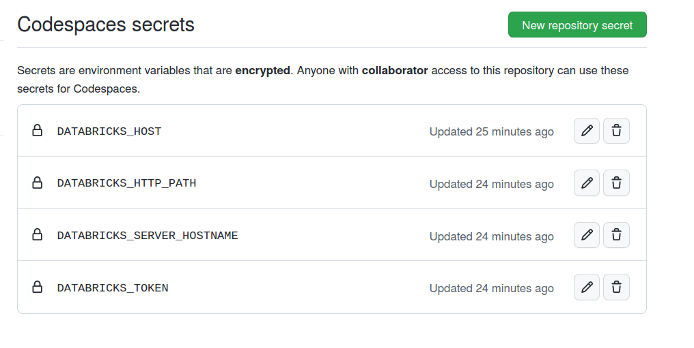
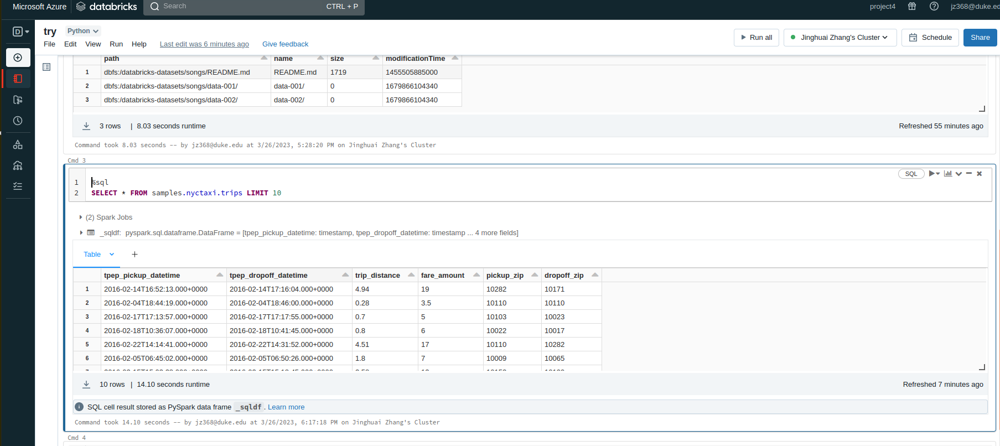
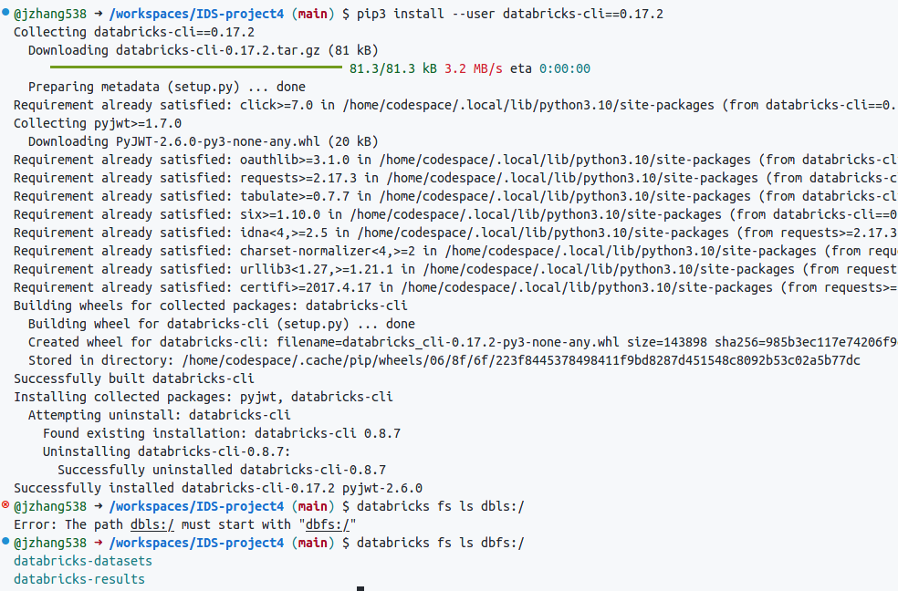

# Jinghuai Zhang-Project-4-Cloud Service with Big Data

In this project, I aim to build a functional web micriservice that employs the Mirosoft Azure Databricks to manage the big data. Databricks provides a unified set of tools for building, deploying, sharing, and maintaining data solutions at scale, which serves as a solid foundation for cloud service. Therefore, I hope that I can have a better understanding about data management with Databricks through this project. For my project, I link the Databricks with the github workspace so that the cloud service provider can easily manage (e.g., query) the user data (e.g. trip information of the users in my case) in their workspace.

### Environment Setup

* Create an account of Mirosoft Azure via this link: https://portal.azure.com/

* Create a new service of Azure Databricks and launch the workspace

* Create a new cluster

* Enable the DBFS File Broswer

* Check the JDBC and ODBC information of the created cluster

* According to the JDBC and ODBC information, setup the OS environment of the github repo:

* Visualize/play with the target dataset in the Databricks using SQL

* Setup the environment of github workspace (e.g., install the library of databricks-cli):

* Run the program to track the big data in Databricks via: 

`python3 quick_run.py` 

* Query the first-k trips information via url command:

